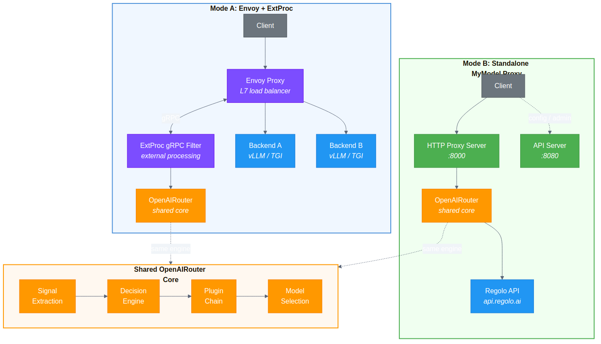
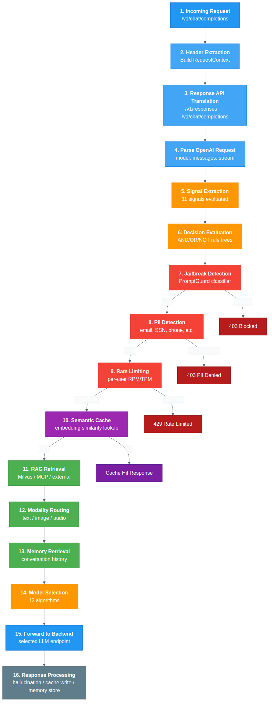
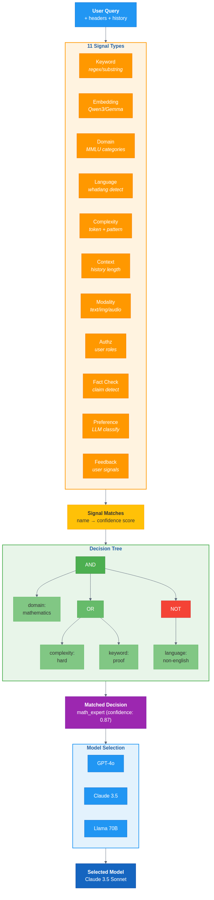

<div align="center">

# Semantic Router

**Intelligent LLM Gateway with Signal-Driven Routing, Multimodal Support, and 12 Model Selection Algorithms**

[](LICENSE)
[](https://go.dev)
[](https://github.com/huggingface/candle)

*Fork of [vLLM Semantic Router](https://github.com/vllm-project/semantic-router) — extended with standalone HTTP proxy mode, Brick multimodal virtual model, and Regolo API integration.*

</div>

---

## Table of Contents

- [Architecture Overview](#architecture-overview)
- [Brick Virtual Model](#brick-virtual-model)
- [Request Pipeline](#request-pipeline)
- [Signal-Decision Engine](#signal-decision-engine)
- [Model Selection](#model-selection)
- [Plugin Chain](#plugin-chain)
- [Rust Bindings (CGO)](#rust-bindings-cgo)
- [Quick Start](#quick-start)
- [Configuration](#configuration)
- [Benchmarks](#benchmarks)
- [Observability](#observability)
- [Attribution](#attribution)

---

## Architecture Overview

This fork supports **two deployment modes** that share the same `OpenAIRouter` core engine:

| | **Mode A: Envoy + ExtProc** | **Mode B: Standalone MyModel Proxy** |
|---|---|---|
| **Use case** | Self-hosted vLLM / TGI backends | Cloud-native via Regolo API |
| **Proxy** | Envoy L7 with gRPC ExtProc filter | Built-in Go HTTP server (`:8000`) |
| **Backend** | Direct to vLLM/TGI instances | Regolo API (`api.regolo.ai`) |
| **Config** | Envoy + ExtProc + backend clusters | Single `config.yaml` |
| **Scaling** | Envoy handles load balancing | Regolo handles backend scaling |

Both modes share the identical routing core: signal extraction, decision evaluation, plugin chain, and model selection.

<div align="center">

</div>

### Key entry points

| File | Purpose |
|------|---------|
| `src/semantic-router/cmd/main.go` | Application entry — initializes router, API server, proxy |
| `src/semantic-router/pkg/proxy/server.go` | HTTP proxy server (Mode B) — handles `/v1/chat/completions`, `/v1/models`, `/health` |
| `src/semantic-router/pkg/extproc/router.go` | `OpenAIRouter` — shared routing core used by both modes |
| `src/semantic-router/pkg/extproc/processor_req_body.go` | Request pipeline — 16-stage processing flow |

---

## Brick Virtual Model

**Brick** is a unified multimodal gateway exposed as a virtual model named `"brick"`. It accepts any combination of text, images, and audio in a standard OpenAI chat completion request and intelligently routes to the appropriate backend.

<div align="center">

</div>

### Routing logic

| Input Modality | Action | Target |
|---|---|---|
| **Image + Text** | Preserve original multimodal body | Vision model (direct forward) |
| **Image only** | OCR extraction via vision model | If extracted text >= `ocr_min_text_length` → semantic pipeline; otherwise → vision model |
| **Audio only** | Transcribe via Whisper API | Semantic pipeline with transcribed text |
| **Audio + Image** | Parallel OCR + STT | Semantic pipeline with combined text |
| **Text only** | Pass through | Semantic pipeline |

**Direct bypass:** Set `x-selected-model: <model-name>` header to skip routing entirely and forward to a specific backend model.

### Key files

| File | Purpose |
|------|---------|
| `src/semantic-router/pkg/proxy/brick.go` | Brick request handler — modality detection, preprocessing, routing |
| `src/semantic-router/pkg/multimodal/multimodal.go` | `Preprocess()` — OCR, STT, modality extraction |

### Configuration

```yaml
brick:
  enabled: true
  vision_model: "gpt-4o"
  vision_endpoint: "https://api.regolo.ai/v1"
  audio_model: "whisper-large-v3"
  audio_endpoint: "https://api.regolo.ai/v1"
  ocr_min_text_length: 50
```

---

## Request Pipeline

Every request passes through a **16-stage pipeline** with early-exit branches for security violations and cache hits.

<div align="center">

</div>

| Stage | Component | Early Exit |
|-------|-----------|------------|
| 1 | **Incoming request** — `/v1/chat/completions` or `/v1/responses` | |
| 2 | **Header extraction** — build `RequestContext` from HTTP headers | |
| 3 | **Response API translation** — convert `/v1/responses` to chat format | |
| 4 | **Parse OpenAI request** — extract model, messages, stream flag | |
| 5 | **Signal extraction** — evaluate all 11 signal types | |
| 6 | **Decision evaluation** — AND/OR/NOT rule trees with confidence | |
| 7 | **Jailbreak detection** — PromptGuard classifier | 403 if detected |
| 8 | **PII detection** — email, SSN, phone, credit card, passport | 403 if policy violated |
| 9 | **Rate limiting** — per-user RPM/TPM enforcement | 429 if exceeded |
| 10 | **Semantic cache** — embedding similarity lookup | Cache hit response |
| 11 | **RAG retrieval** — Milvus / MCP / external API context injection | |
| 12 | **Modality routing** — route to vision/audio/diffusion models | |
| 13 | **Memory retrieval** — inject long-term conversation context | |
| 14 | **Model selection** — choose best model from candidates (12 algorithms) | |
| 15 | **Forward to backend** — send to selected LLM endpoint | |
| 16 | **Response processing** — hallucination detection, cache write, memory store | |

### Implementation

The pipeline is implemented in `processor_req_body.go` as a sequential filter chain. Each filter can:
- **Pass** — continue to next stage
- **Block** — return an error response (403/429)
- **Short-circuit** — return a cached/direct response

---

## Signal-Decision Engine

The routing engine evaluates **11 signal types** against the user query, then matches signals to **decision rules** using a recursive boolean tree.

<div align="center">

</div>

### Signal types

| Signal | Method | Config Key | Example Values |
|--------|--------|------------|----------------|
| **Keyword** | Regex/substring match | `signals.keywords[]` | `"jailbreak_attempt"`, `"code_request"` |
| **Embedding** | Semantic similarity (Qwen3/Gemma) | `signals.embeddings[]` | `threshold: 0.72` |
| **Domain** | MMLU category classification | `signals.categories[]` | `"mathematics"`, `"physics"` |
| **Language** | `whatlang` ISO 639 detection | automatic | `"en"`, `"zh"`, `"es"` |
| **Complexity** | Token count + keyword patterns | automatic | `"simple"`, `"moderate"`, `"hard"` |
| **Context** | Conversation history length | automatic | `"low_token_count"`, `"high_context"` |
| **Modality** | Content type detection | `multimodal_detector` | `"text"`, `"image"`, `"audio"` |
| **Authz** | User role/group from headers | `authz.identity` | `"admin"`, `"premium_user"` |
| **Fact Check** | External guardrail model | `fact_check_model` | `"needs_fact_check"` |
| **Preference** | LLM-based intent classification | `signals.preferences[]` | `"code_generation"`, `"bug_fixing"` |
| **Feedback** | User satisfaction signals | automatic | `"satisfied"`, `"want_different"` |

### Boolean decision tree

Decisions are defined as recursive rule trees with three operators:

| Operator | Behavior | Confidence |
|----------|----------|------------|
| **AND** | All children must match | `avg(children)` |
| **OR** | At least one child matches | `max(children)` |
| **NOT** | Invert single child | `1.0` if child is false |

```yaml
decisions:
  - name: "math_expert"
    priority: 10
    models: ["claude-3.5-sonnet", "gpt-4o"]
    selection_method: "elo"
    rules:
      operator: "AND"
      conditions:
        - type: "domain"
          name: "mathematics"
        - operator: "OR"
          conditions:
            - type: "complexity"
              name: "hard"
            - type: "keyword"
              name: "proof"
        - operator: "NOT"
          conditions:
            - type: "language"
              name: "non-english"
```

**Decision selection strategy:** `"priority"` (sort by priority field) or `"confidence"` (sort by computed confidence score).

### Key files

| File | Purpose |
|------|---------|
| `src/semantic-router/pkg/decision/engine.go` | `DecisionEngine` — `evalNode()` / `evalLeaf()` recursive evaluation |
| `src/semantic-router/pkg/extproc/req_filter_classification.go` | `EvaluateAllSignalsWithHeaders()` — parallel signal extraction |

---

## Model Selection

Once a decision matches and its candidate models are identified, the **selector** chooses the best model. This fork implements **12 selection algorithms** organized in three tiers.

### Tier 1 — Rule-based

| Method | Description | Reference |
|--------|-------------|-----------|
| `static` | Fixed scores from config (`model_config[].score`) | — |
| `latency_aware` | Select fastest model by TPOT/TTFT percentile stats | — |

### Tier 2 — Classical ML

| Method | Description | Reference |
|--------|-------------|-----------|
| `knn` | K-Nearest Neighbors with quality-weighted voting | [FusionFactory](https://arxiv.org/abs/2507.10540) |
| `kmeans` | Cluster-based routing by quality+latency scores | [Avengers-Pro](https://arxiv.org/abs/2508.12631) |
| `svm` | SVM with RBF kernel decision boundaries | [FusionFactory](https://arxiv.org/abs/2507.10540) |
| `mlp` | GPU-accelerated neural network classifier (Candle) | [FusionFactory](https://arxiv.org/abs/2507.10540) |

### Tier 3 — Advanced

| Method | Description | Reference |
|--------|-------------|-----------|
| `elo` | Weighted Elo rating via Bradley-Terry model | [RouteLLM](https://arxiv.org/abs/2406.18665) |
| `router_dc` | Dual-contrastive learning for query-to-model routing | [RouterDC](https://arxiv.org/abs/2409.19886) |
| `automix` | POMDP-based cascaded routing with self-verification | [AutoMix](https://arxiv.org/abs/2310.12963) |
| `hybrid` | Blends Elo + embedding similarity + cost weights | [Hybrid LLM](https://arxiv.org/abs/2404.14618) |
| `rl_driven` | RL with Router-R1 reward (format, outcome, cost) | [Router-R1](https://arxiv.org/abs/2506.09033) |
| `gmtrouter` | Heterogeneous graph learning for personalized routing | [GMTRouter](https://arxiv.org/abs/2511.08590) |

### Selector interface

All selectors implement:

```go
type Selector interface {
    Select(ctx context.Context, selCtx *SelectionContext) (*SelectionResult, error)
    Method() SelectionMethod
    UpdateFeedback(ctx context.Context, feedback *Feedback) error
}
```

### Key files

| File | Purpose |
|------|---------|
| `src/semantic-router/pkg/selection/selector.go` | `Selector` interface, `SelectionContext`, all method constants |
| `src/semantic-router/pkg/selection/elo.go` | Elo rating with Bradley-Terry pairwise comparisons |
| `src/semantic-router/pkg/selection/router_dc.go` | RouterDC dual-contrastive learning |
| `src/semantic-router/pkg/selection/automix.go` | AutoMix POMDP cascaded routing |
| `src/semantic-router/pkg/selection/hybrid.go` | Hybrid multi-technique blending |
| `src/semantic-router/pkg/selection/rl_driven.go` | RL-Driven Router-R1 reward learning |
| `src/semantic-router/pkg/selection/gmtrouter.go` | GMTRouter heterogeneous graph |
| `src/semantic-router/pkg/selection/latency_aware.go` | Latency-aware TPOT/TTFT selection |
| `src/semantic-router/pkg/selection/ml_adapter.go` | KNN, KMeans, SVM, MLP via Candle bindings |

---

## Plugin Chain

Plugins execute in a fixed order during request and response processing. Each plugin can be enabled/disabled per decision.

### Request plugins

| Order | Plugin | File | Description |
|-------|--------|------|-------------|
| 1 | **Jailbreak** | `req_filter_jailbreak.go` | PromptGuard classifier blocks prompt injection attempts |
| 2 | **PII** | `req_filter_pii.go` | Detects email, SSN, phone, credit card, passport; applies per-decision deny policies |
| 3 | **Rate Limit** | `pkg/ratelimit/` | Per-user RPM/TPM enforcement (local or Envoy RLS) |
| 4 | **Semantic Cache** | `req_filter_cache.go` | Embedding similarity lookup; backends: in-memory, Redis, Milvus, HNSW |
| 5 | **RAG** | `req_filter_rag_*.go` | Context retrieval from Milvus, MCP servers, external APIs, vector stores |
| 6 | **Modality** | `req_filter_modality.go` | Routes to vision/audio/diffusion models based on content type |
| 7 | **Memory** | `req_filter_memory.go` | Retrieves long-term conversation memory (Milvus + BM25/semantic) |
| 8 | **Tools** | `req_filter_tools.go` | Selects relevant tools by query similarity, injects into system prompt |

### Response plugins

| Order | Plugin | File | Description |
|-------|--------|------|-------------|
| 9 | **Hallucination** | `res_filter_hallucination.go` | Detects unsupported claims; optional NLI-enhanced explanations |
| 10 | **Memory Store** | via `MemoryExtractor` | Saves conversation summaries for future sessions |
| 11 | **Cache Write** | via pending request queue | Async write of response to semantic cache with per-decision TTL |
| 12 | **Router Replay** | `pkg/routerreplay/` | Records full routing decision for offline analysis and model training |

### Per-decision plugin config

```yaml
decisions:
  - name: "customer_support"
    plugins:
      - type: "jailbreak"
        enabled: true
        threshold: 0.8
      - type: "pii"
        enabled: true
        policy:
          deny: [email, ssn, credit_card]
      - type: "semantic_cache"
        enabled: true
        threshold: 0.85
        ttl: 3600
      - type: "hallucination"
        enabled: true
        action: "header"  # header | body | none
```

---

## Rust Bindings (CGO)

ML inference runs in Rust via [candle](https://github.com/huggingface/candle), bridged to Go through CGO. This avoids Python dependencies at runtime while keeping GPU-accelerated inference.

### Models

| Binding | Models | Dimension | Use |
|---------|--------|-----------|-----|
| **Embedding (batch)** | Qwen3-Embedding (3B) | 1024 | Semantic cache, signal matching |
| **Embedding** | Gemma-2B, mmBERT | 768 / 384 | Domain classification, vector store |
| **Modality classifier** | Custom CNN | — | Text/image/audio/diffusion detection |
| **NLI** | DeBERTa-v3 | — | Hallucination detection entailment |

### Build pipeline

```bash
# 1. Build Rust shared library
cd candle-binding && cargo build --release

# 2. Set library path
export LD_LIBRARY_PATH=$PWD/candle-binding/target/release
export CGO_ENABLED=1

# 3. Build Go binary (links against libcandle_binding.so)
cd src/semantic-router && go build -o router ./cmd/
```

### Environment notes

- **hf-hub** uses `rustls-tls` (no OpenSSL system dependency)
- **whatlang** 0.16 uses `Lang::Nob` for Norwegian (not `Nor`)
- Models are auto-downloaded from HuggingFace on first startup via `modeldownload.EnsureModels()`

---

## Quick Start

### Docker (recommended)

```bash
# 1. Build the image
make docker-build-mymodel

# 2. Create config.yaml (see Configuration section below)

# 3. Set API keys
export REGOLO_API_KEY="your-key"

# 4. Run
docker compose -f deploy/docker-compose/docker-compose.yml up
```

The proxy is available at `http://localhost:8000`.

### From source

```bash
# Prerequisites: Go 1.24+, Rust (for candle bindings)

# 1. Build
make build

# 2. Run
make run-router CONFIG=config.yaml
```

### Test it

```bash
# Health check
curl http://localhost:8000/health

# List models
curl http://localhost:8000/v1/models

# Chat completion (routes through semantic pipeline)
curl http://localhost:8000/v1/chat/completions \
  -H "Content-Type: application/json" \
  -d '{
    "model": "auto",
    "messages": [{"role": "user", "content": "Prove that sqrt(2) is irrational"}],
    "stream": false
  }'

# Brick multimodal request
curl http://localhost:8000/v1/chat/completions \
  -H "Content-Type: application/json" \
  -d '{
    "model": "brick",
    "messages": [{"role": "user", "content": [
      {"type": "text", "text": "Describe this image"},
      {"type": "image_url", "image_url": {"url": "data:image/png;base64,..."}}
    ]}],
    "stream": false
  }'
```

### Ports

| Port | Service |
|------|---------|
| `8000` | HTTP proxy (OpenAI-compatible API) |
| `8080` | API server (dashboard, batch classification, config) |
| `9190` | Prometheus metrics |

---

## Configuration

The router is configured via a single `config.yaml` file. Key sections:

### Signals

```yaml
signals:
  keywords:
    - name: "code_request"
      operator: "OR"
      keywords: ["write a function", "implement", "code this"]
  embeddings:
    - name: "fast_qa_en"
      threshold: 0.72
      aggregation_method: "max"  # max | mean
      candidates:
        - "Hello, how are you?"
        - "What time is it?"
  preferences:
    - name: "code_generation"
      description: "Generating new code snippets or functions"
```

### Decisions + model selection

```yaml
intelligent_routing:
  decisions:
    - name: "code_expert"
      priority: 10
      models: ["claude-3.5-sonnet", "gpt-4o", "deepseek-coder"]
      selection_method: "hybrid"
      rules:
        operator: "OR"
        conditions:
          - type: "keyword"
            name: "code_request"
          - type: "preference"
            name: "code_generation"
    - name: "default"
      priority: 1
      models: ["gpt-4o-mini"]
      selection_method: "static"
      rules:
        operator: "OR"
        conditions:
          - type: "keyword"
            name: "any"
```

### Backend models

```yaml
model_config:
  claude-3.5-sonnet:
    endpoint: "https://api.regolo.ai/v1"
    api_format: "openai"
    score: 0.9
  gpt-4o:
    endpoint: "https://api.regolo.ai/v1"
    api_format: "openai"
    score: 0.85
```

### Semantic cache

```yaml
semantic_cache:
  enabled: true
  backend: "memory"       # memory | redis | milvus | hnsw
  embedding_model: "qwen3"
  similarity_threshold: 0.85
  ttl: 3600
```

### Observability

```yaml
observability:
  logging:
    level: "info"
    encoding: "json"
  tracing:
    enabled: true
    provider: "otlp"
    exporter:
      endpoint: "http://jaeger:4317"
    sampling_rate: 1.0
```

---

## Benchmarks

### Microbenchmarks

Located in `perf/benchmarks/`:

| Benchmark | File | Measures |
|-----------|------|----------|
| **Cache search** (1K/10K entries, HNSW) | `cache_bench_test.go` | P95/P99 latency, QPS, hit rate |
| **Signal classification** | `classification_bench_test.go` | Signal evaluation throughput |
| **Decision evaluation** | `decision_bench_test.go` | Rule tree latency, operator overhead |
| **Full pipeline** (ExtProc) | `extproc_bench_test.go` | End-to-end request latency |
| **Preference matching** | `preference_bench_test.go` | LLM-based preference classification |

```bash
# Run all benchmarks
cd perf/benchmarks && go test -bench=. -benchmem
```

### E2E test suite

Located in `e2e/testcases/`:

| Test | File | Description |
|------|------|-------------|
| Performance throughput | `performance_throughput.go` | Request QPS under load |
| Dynamo comparison | `dynamo_performance_comparison.go` | Dynamic vs static routing latency |
| Cache integration | `cache.go` | Semantic cache hit/miss with real embeddings |
| Domain classification | `domain_classify.go` | MMLU category accuracy |
| Selection strategies | `core_selection.go` | All 12 selection algorithms correctness |
| Decision priority | `decision_priority.go` | Rule priority ordering |
| Embedding signal | `embedding_signal_routing.go` | Semantic similarity routing accuracy |

### CI

- **Per-PR:** `.github/workflows/performance-test.yml` — runs benchmark suite on every pull request
- **Nightly:** `.github/workflows/performance-nightly.yml` — regression detection with historical comparison

---

## Observability

### Metrics (Prometheus)

Exposed on `:9190/metrics`. Key metrics:

| Metric | Type | Labels |
|--------|------|--------|
| `llm_model_requests_total` | Counter | `model` |
| `llm_request_errors_total` | Counter | `model`, `reason` (timeout, upstream_5xx, pii_denied, jailbreak, parse, cancellation) |
| `llm_model_tokens_total` | Counter | `model` |
| `llm_model_cost_total` | Counter | `model`, `currency` |
| `llm_decision_evaluation_seconds` | Histogram | — |
| `llm_cache_hits_total` | Counter | — |
| `llm_cache_misses_total` | Counter | — |
| `llm_pii_detected_total` | Counter | — |
| `llm_jailbreak_detected_total` | Counter | — |
| `llm_hallucination_detected_total` | Counter | — |

### Tracing (OpenTelemetry)

Span hierarchy per request:

```
Request
├── Signal Evaluation
├── Decision Evaluation
├── Plugin: Jailbreak
├── Plugin: PII
├── Plugin: Semantic Cache
├── Plugin: RAG
├── Plugin: Memory
├── Model Selection
├── Backend Forward
└── Plugin: Hallucination
```

Supported backends: **Jaeger** (OTLP gRPC), **Zipkin**. Configure via `observability.tracing` in `config.yaml`.

### Logging (Zap)

Structured JSON logging with configurable level. Key log events:
- `cache_hit` / `cache_miss` — with query hash and similarity score
- `decision_matched` — with decision name and confidence
- `model_selected` — with model name and selection method
- `pii_detected` / `jailbreak_detected` — security events

---

## Attribution

This project is a fork of [vLLM Semantic Router](https://github.com/vllm-project/semantic-router), licensed under the **Apache License 2.0**.

### What this fork adds

- **Standalone HTTP Proxy mode** — no Envoy dependency, direct HTTP routing via Go server
- **Brick virtual model** — unified multimodal gateway with OCR, STT, and modality-aware routing
- **Regolo API integration** — cloud-native backend with automatic API key management
- **Response API support** — `/v1/responses` endpoint translation to chat completions
- **Extended model selection** — KNN, KMeans, SVM, MLP, GMTRouter algorithms
- **Enhanced plugin chain** — tools selection, memory retrieval, router replay recording

### License

```
Copyright 2025 vLLM Semantic Router

Licensed under the Apache License, Version 2.0 (the "License");
you may not use this file except in compliance with the License.
You may obtain a copy of the License at

    http://www.apache.org/licenses/LICENSE-2.0
```
