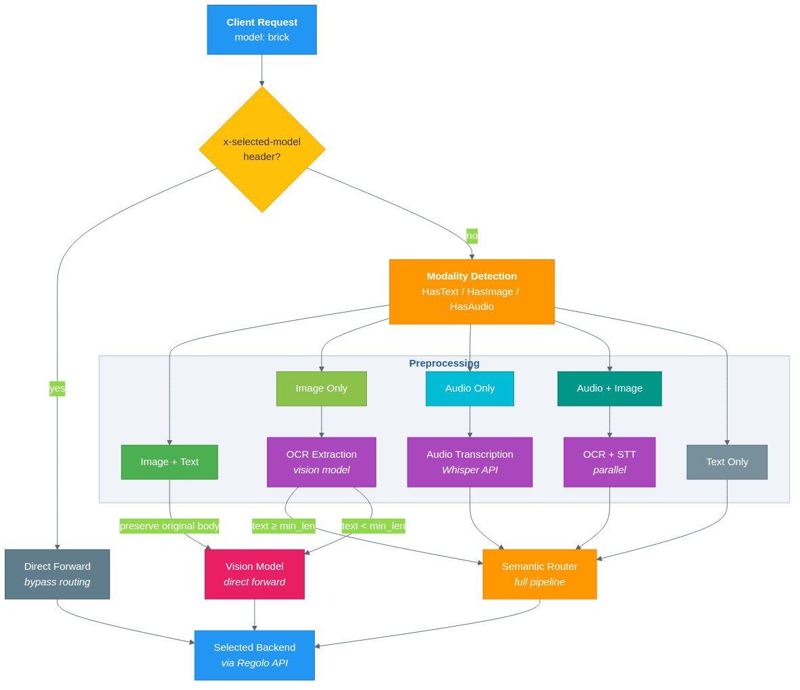

<div align="center">

# Brick: Multimodal LLM Routing Gateway

**A transparent virtual model for unified text, image, and audio routing over OpenAI-compatible APIs**

[](LICENSE)
[](https://go.dev)
[](https://platform.openai.com/docs/api-reference)

*Fork of [vLLM Semantic Router](https://github.com/vllm-project/semantic-router) · Full gateway via [MyModel](https://github.com/massaindustries/mymodel)*

</div>

---

## Abstract

Modern LLM deployments face a fragmentation problem: different input modalities — text, images, and audio — require different backend models and different API endpoints, forcing clients to implement modality detection and model selection logic themselves. This breaks the promise of a unified chat completion interface and creates operational overhead as modality requirements evolve. We present **Brick**, a multimodal routing gateway that exposes a single virtual model (`model: "brick"`) accepting any combination of text, images, and audio in standard OpenAI chat completion format. Brick detects input modality, performs OCR and speech-to-text preprocessing concurrently where needed, and routes to the appropriate backend — either directly to a vision model for image+text inputs, or through the semantic routing pipeline for text-derived content — without any client-side changes required. Brick operates as a transparent proxy: clients send the same JSON they would send to any OpenAI-compatible endpoint, and the `x-selected-model` response header reports which backend was selected.

---

## 1. Introduction

Large language model APIs have converged on the OpenAI chat completions format as a de-facto standard. However, this standard was designed for text, and multimodal inputs — images, audio, documents — have been grafted on in incompatible ways: some providers accept `image_url` content parts, others require separate transcription endpoints, and vision models and text models live at different API paths.

The result is that any application handling mixed-modality inputs must implement its own preprocessing layer: detect whether the request contains an image, call a transcription API for audio, invoke an OCR model for image-only inputs, and then route to the correct backend. This logic is duplicated across clients and is brittle when providers change their APIs.

**Brick** moves this logic into the gateway. From a client's perspective, there is one model (`"brick"`) and one endpoint (`/v1/chat/completions`). Brick handles modality detection, preprocessing, and backend selection transparently, returning responses in the standard OpenAI format regardless of which backend was used.

Brick is implemented as part of the [MyModel](https://github.com/massaindustries/mymodel) LLM hosting gateway, which provides the full semantic routing pipeline, plugin chain, and model selection algorithms that Brick delegates text-derived content to.

---

## 2. System Design

### 2.1 Brick as a Virtual Model

Brick is exposed to clients as a named model. No special headers or parameters are required:

```json
{
  "model": "brick",
  "messages": [
    {
      "role": "user",
      "content": [
        {"type": "text", "text": "What does this document say?"},
        {"type": "image_url", "image_url": {"url": "data:image/png;base64,..."}}
      ]
    }
  ]
}
```

The gateway intercepts requests for `model: "brick"` before they reach the routing pipeline, runs modality detection on the message content, and dispatches accordingly.

### 2.2 Modality Detection and Routing

The preprocessing pipeline inspects each message's content parts to classify the request into one of five modality combinations:

<div align="center">

</div>

| Input Modality | Action | Destination |
|---|---|---|
| **Image + Text** | Preserve original multimodal body | Vision model (direct forward) |
| **Image only** | OCR via dedicated OCR model | If `len(text) ≥ ocr_min_text_length` → semantic pipeline; otherwise → vision model |
| **Audio only** | Transcribe via Whisper-compatible STT endpoint | Semantic pipeline with transcribed text |
| **Audio + Image** | Parallel OCR + STT (concurrent goroutines) | Semantic pipeline with combined text |
| **Text only** | No preprocessing | Semantic pipeline |

The key insight in the routing table is the **image-only fallback**: OCR is attempted first (cheaper, faster), but if the OCR result is too short — indicating a photograph rather than a document — Brick falls back to forwarding directly to the vision model with the original image content intact.

### 2.3 Direct Bypass

Clients who have already determined the appropriate backend can set `x-selected-model: <model-name>` in the request header. Brick validates that the named model exists in the backend configuration and forwards the request directly, bypassing all preprocessing. This is useful for clients that perform their own modality detection or want to pin to a specific model for a session.

### 2.4 Response Transparency

Brick sets `x-selected-model` on the response to report which backend model handled the request. This allows clients to observe routing decisions without needing to implement routing logic themselves — useful for logging, debugging, and cost attribution.

---

## 3. Implementation

Brick is implemented in Go 1.24 as part of the semantic router's HTTP proxy server. The preprocessing pipeline runs within the request handler and completes before the routing decision is made.

### Key files

| File | Purpose |
|------|---------|
| `pkg/proxy/brick.go` | Main handler — modality dispatch, `x-selected-model` bypass, pipeline integration |
| `pkg/multimodal/multimodal.go` | `Preprocess()` — concurrent OCR + STT, modality extraction, body rewriting |
| `pkg/config/mymodel.go` | `BrickConfig` struct — all configurable fields with YAML tags |

### Concurrent preprocessing

When a request contains both audio and image content, OCR and transcription run in parallel via Go goroutines:

```go
var wg sync.WaitGroup
wg.Add(2)
go func() { defer wg.Done(); transcribedText, _ = TranscribeAudio(ctx, ...) }()
go func() { defer wg.Done(); ocrText, _ = OCRImage(ctx, ...) }()
wg.Wait()
```

This minimizes latency for mixed-modality inputs without complicating the caller.

### Pipeline integration

After preprocessing, text-derived content is rewritten into the request body and passed to the standard semantic routing pipeline. The pipeline evaluates 11 signal types (keyword, embedding, domain, language, complexity, context, modality, authz, fact_check, preference, feedback) against the extracted text and selects the best backend from a configurable model pool. See [MyModel](https://github.com/massaindustries/mymodel) for full pipeline documentation.

---

## 4. Configuration

Brick is configured via a `brick:` section in `config.yaml`. All fields are required when `enabled: true`.

```yaml
brick:
  enabled: true

  # Vision model for image+text forwarding and image-only fallback
  vision_model: "qwen3-vl-32b"
  vision_endpoint: "https://api.regolo.ai/v1"

  # Dedicated OCR model for image-only inputs
  ocr_model: "deepseek-ocr"
  ocr_endpoint: "https://api.regolo.ai/v1/chat/completions"

  # Speech-to-text for audio inputs
  stt_model: "faster-whisper-large-v3"
  stt_endpoint: "https://api.regolo.ai/v1/audio/transcriptions"

  # Minimum character count for OCR result to be considered valid text.
  # Below this threshold, image-only inputs fall back to the vision model.
  ocr_min_text_length: 50
```

API keys are resolved from the `providers.regoloai.api_key` field or from the `REGOLO_API_KEY` environment variable. Client-supplied `Authorization: Bearer <key>` headers take precedence if provided.

---

## 5. Quick Start

### Docker Compose

```bash
# Clone the repo and set your API key
export REGOLO_API_KEY="your-key"

# Start the gateway (proxy on :8000, metrics on :9190)
docker compose -f deploy/docker-compose/docker-compose.yml up
```

Or via the [MyModel CLI](https://github.com/massaindustries/mymodel):

```bash
pip install mymodel
mymodel init       # interactive configuration wizard
mymodel serve      # starts Go binary → Docker → Python (auto fallback)
```

### Send a multimodal request

```bash
# Image + text → direct forward to vision model
curl http://localhost:8000/v1/chat/completions \
  -H "Content-Type: application/json" \
  -H "Authorization: Bearer $REGOLO_API_KEY" \
  -d '{
    "model": "brick",
    "messages": [{
      "role": "user",
      "content": [
        {"type": "text", "text": "Summarize the key points in this slide"},
        {"type": "image_url", "image_url": {"url": "data:image/png;base64,<BASE64>"}}
      ]
    }]
  }'
```

```bash
# Audio → transcribe via STT, then route through semantic pipeline
curl http://localhost:8000/v1/chat/completions \
  -H "Content-Type: application/json" \
  -H "Authorization: Bearer $REGOLO_API_KEY" \
  -d '{
    "model": "brick",
    "messages": [{
      "role": "user",
      "content": [
        {"type": "input_audio", "input_audio": {"data": "<BASE64_WAV>", "format": "wav"}}
      ]
    }]
  }'
```

```bash
# Direct bypass — skip routing, forward to a specific backend
curl http://localhost:8000/v1/chat/completions \
  -H "Content-Type: application/json" \
  -H "Authorization: Bearer $REGOLO_API_KEY" \
  -H "x-selected-model: gpt-4o" \
  -d '{
    "model": "brick",
    "messages": [{"role": "user", "content": "Hello"}]
  }'
```

Check the `x-selected-model` response header to see which backend was chosen.

### Health check

```bash
curl http://localhost:8000/health
curl http://localhost:8000/v1/models   # lists "brick" and all configured backends
```

---

## 6. Acknowledgements & Attribution

Brick is built on top of the [vLLM Semantic Router](https://github.com/vllm-project/semantic-router), licensed under the **Apache License 2.0**. The semantic routing pipeline, plugin chain (jailbreak detection, PII filtering, semantic cache, RAG, memory, hallucination detection), and model selection algorithms (including [RouteLLM](https://arxiv.org/abs/2406.18665), [AutoMix](https://arxiv.org/abs/2310.12963), [RouterDC](https://arxiv.org/abs/2409.19886), and [Router-R1](https://arxiv.org/abs/2506.09033)) are documented in the full [MyModel](https://github.com/massaindustries/mymodel) gateway repository.

### What this fork adds over vLLM SR

- **Standalone HTTP proxy mode** — no Envoy dependency; direct HTTP server on `:8000`
- **Brick virtual model** — unified multimodal gateway with concurrent OCR + STT preprocessing
- **Regolo API integration** — cloud-native backend with `${ENV_VAR}` key resolution
- **OpenAI `/v1/responses` translation** — maps the newer Responses API format to chat completions

### License

```
Copyright 2025 vLLM Semantic Router Contributors

Licensed under the Apache License, Version 2.0 (the "License");
you may not use this file except in compliance with the License.
You may obtain a copy of the License at

    http://www.apache.org/licenses/LICENSE-2.0
```
