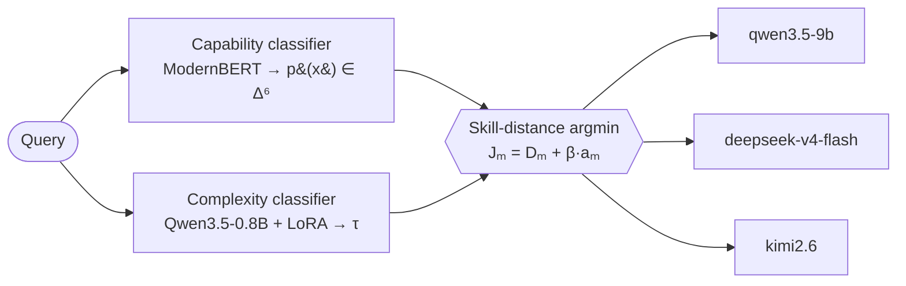

<div align="center">


### One Query, One Endpoint, Every LLM on Earth.

Brick is a **Mixture-of-Models (MoM) routing gateway**. It reads each prompt's
**capability** and **complexity**, then routes it to the best backend in a pool of
open- and closed-weight LLMs, matching the strongest single model's quality at a
fraction of its cost. No cascades. No wasted calls. Drop-in `model: "brick"`.

[](https://github.com/regolo-ai/brick-SR1/actions/workflows/ci.yml)
[](https://github.com/regolo-ai/brick-SR1/releases/latest)
[](LICENSE)
[](https://github.com/regolo-ai/brick-SR1/commits)
[](https://github.com/regolo-ai/brick-SR1/stargazers)
[](https://github.com/regolo-ai/brick-SR1/issues)

[](https://go.dev)
[](https://www.rust-lang.org)
[](https://www.python.org)
[](https://platform.openai.com/docs/api-reference)
[](#-datasets--models)

**[When to use Brick](#-when-can-i-use-brick) · [Quickstart](#-quickstart) · [Why Brick](#-why-brick) · [Claude Code](#-brick--claude-code) · [Codex](#-use-it-on-codex) · [FAQ](#-faq) · [Benchmarks](#-results-dataset-a-n5504) · [How it works](#-how-it-works) · [Paper](#-paper)**

</div>

---

## 🧩 When can I use Brick?

Brick is for anyone running against more than one model, or paying flat rate for a single strong one. Three common cases:

1. **You have a pool of models and want each query to reach the right one.**
   Cheap prompts should not burn your most expensive model, and hard prompts should not be starved on a small one. Brick reads capability and complexity per query and dispatches accordingly, so the pool works as one graded system instead of a manual pick.

2. **You want to cut Claude Code / Codex costs without losing quality.**
   Put Brick in front of your coding agent and every request is routed to the cheapest model that can actually do the job, escalating only when the task needs it. You keep the same UX and pay for the hard turns, not the easy ones.

3. **You want to unify different models behind one tool.**
   Use OpenAI models, GLM, DeepSeek, Kimi, Qwen and others from inside Claude Code or Codex through a single OpenAI-compatible endpoint. Define the pool once in `config.yaml` and call `model: "brick"` everywhere.

---

## ⚡ Quickstart

The fastest working path today is the CLI, which self-hosts the router and wires it into
**Claude Code** for you. Requires Node >= 18 and Docker.

```bash
git clone https://github.com/regolo-ai/brick-SR1.git
cd brick-SR1/apps/cli && npm install && npm run build && npm link

brick claude on     # starts the router + wires ANTHROPIC_BASE_URL in ~/.claude/settings.json
```

Then open a **new** Claude Code session and pick **brick-claude** in the `/model` picker.
Every request now routes to haiku / sonnet / opus by capability and complexity. See
[Brick + Claude Code](#-brick--claude-code) for modes, the effort picker, and the live
`brick claude status` dashboard.

<details>
<summary><b>Prefer a raw OpenAI-compatible gateway (no CLI)?</b></summary>

The image is published on Docker Hub (public, no login required). Run the gateway directly:

```bash
docker run --rm -p 18000:18000 \
  -e REGOLO_API_KEY=$REGOLO_API_KEY \
  docker.io/regolo/brick:latest      # or pin a version: docker.io/regolo/brick:2.2.0
```

Then call it like any OpenAI endpoint, just set `"model": "brick"`:

```bash
curl http://localhost:18000/v1/chat/completions \
  -H "Authorization: Bearer $REGOLO_API_KEY" \
  -H "Content-Type: application/json" \
  -d '{"model":"brick","messages":[{"role":"user","content":"Prove that sqrt(2) is irrational"}]}'
```

The `x-selected-model` response header tells you which backend Brick picked.
That math prompt routes to a reasoning model; `"Hello"` routes to the cheapest one.

Until then, `brick serve` (from the CLI above) runs the same router locally from source.

</details>

---

## 🤔 Why Brick

| | Single model | RouteLLM | FrugalGPT / Cascade | **Brick** |
|---|:---:|:---:|:---:|:---:|
| One call per query (no cascade waste) | ✅ | ✅ | ❌ | ✅ |
| Capability-aware (6 dimensions) | n/a | ❌ binary | ❌ | ✅ |
| Complexity-aware | n/a | partial | ✅ | ✅ |
| Pool of N open + closed models | n/a | 2 | few | ✅ |
| Continuous cost ↔ quality knob | ❌ | ❌ | threshold | ✅ `r ∈ [-1, 1]` |
| Native multimodal (image / audio) | varies | ❌ | ❌ | ✅ |
| Drop-in OpenAI-compatible | n/a | n/a | n/a | ✅ |

Cascade routers (FrugalGPT, Cascade Routing) call models one after another until a
confidence check passes, paying for every miss in tokens and latency. Brick makes a
**single forward decision** per query, so there is nothing to waste.

---

## 🧠 Brick + Claude Code


https://github.com/user-attachments/assets/13c02f5b-191a-43cb-ad26-12ab6cb44f6a


Put one OpenAI/Anthropic-compatible endpoint in front of Claude Code, and Brick routes every request to **haiku**, **sonnet**, or **opus** based on capability and complexity. You keep the Claude Code UX; Brick picks the cheapest model that can do the job.

### Setup

```bash
brick claude on     # wires ANTHROPIC_BASE_URL in ~/.claude/settings.json, auto-starts the router
```

Then:
1. Open a **new** Claude Code session (your current session is unaffected).
2. In the `/model` picker, select **brick-claude** (it sits alongside the built-in opus/sonnet/haiku aliases, which it does not replace).

To revert:

```bash
brick claude off    # restores ANTHROPIC_BASE_URL, optionally stops the router
```

Use `brick claude on --no-start` to require an already-healthy router instead of auto-starting one, and `brick claude off --stop` / `--keep` to control the router without a prompt.

### The 5 modes: pick your cost/quality trade-off

A mode is how you tell Brick how much to spend. Each one maps easy/medium/hard queries to a model tier, from cheapest (`eco`, always haiku) to strongest (`max`, always opus), with `lite`, `mid` and `pro` in between. Pick one and Brick handles the per-query routing inside it.


https://github.com/user-attachments/assets/396a41a2-822d-4916-a593-78e346ba5db9


You switch mode straight from the **thinking effort** slider in Claude Code's `/model` picker: low picks `eco`, medium `lite`, high `mid`, xhigh `pro`, and max `max`. So the effort control does not set a thinking budget, it selects the model tier. You can also switch explicitly with `brick claude mode` or `brick claude <mode>`.

`mid` is the default. On 1M-context requests the map shifts up since Haiku has no 1M variant: easy and medium resolve to sonnet, hard to opus.

Once you have picked the tier, how hard to think is decided **autonomously per request** from the router's own signals (query difficulty plus the chosen model's headroom).

### Native models bypass the router

Selecting **opus**, **sonnet**, or **haiku** explicitly in the picker skips Brick entirely: the request is forwarded verbatim to that exact model, with no skill routing and no effort override. Only **brick-claude** runs the router.

### Configuration: the `brick claude settings` menu

Everything about *how* Brick routes lives behind one interactive menu:

```bash
brick claude settings
```

Each entry shows its current value and opens a submenu; the defaults are sane, so you only change what you care about. The first time, walk the list top to bottom, starting with **Models**. Every choice is written to the profile config and takes effect on the next request, with no restart of your Claude Code session.

#### Models

The pool of Claude models Brick may route to, plus the allowed thinking modes per model. Set this first: pick which of Haiku 4.5, Sonnet 4.6, Opus 4.8, Sonnet 5 and Fable 5 are in play. The skill-vector router only ever picks from this pool (a difficulty fallback map covers the case where the skill router is off).

#### Context-awareness

Classify on the last *K* conversation turns instead of only the latest message, so routing reflects where the conversation is heading, not just the final line (default `K = 8`).

#### Compute: local vs hosted classifier

Where the complexity classifier runs:

- **`local`** — an auto-spawned Qwen3.5-0.8B server (~1.6 GB VRAM on GPU, or a few seconds per call on CPU).
- **`api`** — the hosted Regolo `brick-complexity-pro` endpoint. You paste your Regolo API key once; it is saved in the profile `.env`, never in the YAML, and you are not asked again on later visits.

#### Subagent routing

Also route Claude Code subagents that pin an explicit native model through Brick, instead of letting them bypass the router.

#### Model routing

On lets Brick pick the model by complexity; off pins every request to one fixed model.

#### Thinking routing

On lets Brick compute the reasoning effort per query; off forwards the client's own effort unchanged.

#### Cache-aware routing

Switching models mid-conversation invalidates the prompt cache: each provider's KV cache is per-model and opaque, so the new model has to reprocess the whole context at full input price. This setting picks how Brick handles that:

- **`off`** — per-request routing, no cross-turn memory. The default.
- **`sticky`** — keep a conversation on its current model unless switching is actually worth it: downswitching to a cheaper model is always free, upswitching only happens when the estimated quality gain clears the cost of re-priming the cache. See [`docs/proof/sticky-savings.md`](docs/proof/sticky-savings.md) for measured savings on real traffic.
- **`smartsqueeze`** — the opposite tack: instead of avoiding switches, make them cheap. Same cache-aware hysteresis as `sticky`, but when a switch *is* taken it compacts the forwarded context (clearing older `tool_result` blocks, keeping recent turns raw) so the new model reprocesses a small prefix instead of the full one. Deterministic and model-agnostic (works across providers, not just Anthropic), never touches the system prompt or first user turn, and only fires on a switch (a warm cache is never disturbed). Ships shadow-first (`compact_shadow_only: true` measures the saving without changing what is served) so you can quantify the win before turning it on.
- **`orchestrator`** — shadow-mode v2 path: computed for evaluation, not yet served.

### Observability

```bash
brick claude status         # live dashboard (default in an interactive terminal)
brick claude status --once  # static one-shot view
```

The dashboard reports, since the last router restart:
- **Routed by model**: count and percent per model.
- **Per-model effort distribution**: how reasoning effort spread out within each model.
- **Difficulty mix**: the classifier's easy/medium/hard verdicts across routed requests.
- **Economy**: an estimated `saved ~X% vs all-opus` over the routed request count (a relative estimate from request mix, excluding real token counts and caching).

It also shows connection/wiring state, classifier latency (avg, p50, p95), and fallback rate.

### Works with workflows and subagents

Brick routing is per request. In Claude Code workflows and subagents, each agent's call is routed **independently** as long as that agent uses **brick-claude**, so a cheap subagent task can land on haiku while a hard one escalates to opus in the same run.

---

## 🤖 Use it on Codex (Still in Beta)

The same idea behind OpenAI Codex: Brick sits in front of Codex and routes each request across your model pool, so you cut cost on easy turns and can drive Codex with non-OpenAI models through one OpenAI-compatible endpoint.

### Setup

```bash
brick codex on      # sets model/model_provider to brick in ~/.codex/config.toml, auto-starts the router
```

This materializes a dedicated Codex profile (the OpenAI-pool skill router) and adds a managed provider pointing at the local router. Start a new Codex session and it now routes through Brick.

To revert:

```bash
brick codex off     # restores your previous Codex model/provider
```

Codex exposes the same 5 modes and status view as Claude Code:

```bash
brick codex mode           # or: brick codex eco | lite | mid | pro | max
brick codex status         # live routing dashboard
```

Use `brick codex on --no-start` to require an already-healthy router instead of auto-starting one. The Claude and Codex router stacks share host port 8000, so only one can serve at a time; stop the other before wiring.

---

## 🔌 Use Brick on its own

You do not need a coding agent. Brick is a plain OpenAI-compatible gateway you can call from any client, script, or app.

```bash
brick serve                       # docker compose up on http://localhost:18000
brick chat                        # TUI chat against the local router
brick route "what is 2+2?"        # print the routing decision for a prompt, no call made
```

Call it like any OpenAI endpoint, just set `"model": "brick"`:

```bash
curl http://localhost:18000/v1/chat/completions \
  -H "Authorization: Bearer $REGOLO_API_KEY" \
  -H "Content-Type: application/json" \
  -d '{"model":"brick","messages":[{"role":"user","content":"Prove that sqrt(2) is irrational"}]}'
```

The `x-selected-model` response header tells you which backend Brick picked. That math prompt routes to a reasoning model; `"Hello"` routes to the cheapest one.

### Configure the pool in `config.yaml`

Everything Brick decides comes from `config.yaml`. The core block is `skill_router`, where you declare the pool, each model's skill vector, and its cost weight:

```yaml
skill_router:
  enabled: true
  capabilities:                 # the 6 dimensions every query and model live in
    - coding
    - creative_synthesis
    - instruction_following
    - math_reasoning
    - planning_agentic
    - world_knowledge

  models:
    - model: "qwen3.5-9b"
      skill_vector: [0.71, 0.51, 0.81, 0.91, 0.58, 0.18]   # capability per dimension
      use_reasoning: false
      cost_weight: 0.10                                     # relative price, drives the cost bias
    - model: "deepseek-v4-flash"
      skill_vector: [0.82, 0.66, 0.86, 0.93, 0.62, 0.49]
      use_reasoning: false
      cost_weight: 0.40
    - model: "kimi2.6"
      skill_vector: [0.90, 0.75, 0.87, 0.94, 0.64, 0.34]
      use_reasoning: true
      reasoning_effort: "medium"
      cost_weight: 0.60
```

Add or swap any OpenAI-compatible backend here; the backends themselves are declared under `provider_profiles` / `model_config` (the shipped config points them all at Regolo). Two more blocks let you nudge routing without touching the math:

```yaml
  keyword_rules:
    - name: "force_coder"       # hard override: send these prompts to a specific model
      mode: "override"
      model: "kimi2.6"
      operator: "OR"
      keywords: ["debug", "refactor", "compile", "write a function"]
    - name: "coding_bias"       # soft nudge: push one capability dimension up
      mode: "bias"
      capability: "coding"
      operator: "OR"
      keywords: ["python", "rust", "sql", "async"]
```

Other useful sections: `brick` (multimodal preprocessing: STT, OCR, vision), the `r` preference knob in `r ∈ [-1, 1]` (max-saving to max-quality), and the classifier endpoints. The CLI can edit most of this for you (`brick add model`, `brick config edit`), or edit the YAML directly. Full field reference: [apps/router/README.md](apps/router/README.md).

---

## 🗂️ What's in the repo

A monorepo to **run**, **use**, and **reproduce** every result in the Brick paper.

| Component | Path | Purpose |
|---|---|---|
| **Router** (Go + Rust) | [`apps/router/`](apps/router/) | OpenAI-format gateway: capability + complexity classifiers, dispatch to the best backend |
| **CLI** (`brick`) | [`apps/cli/`](apps/cli/) | TypeScript/oclif companion to self-host in one command |
| **Training** | [`packages/training/`](packages/training/) | ModernBERT capability sweep + complexity LoRA recipes |
| **Evaluation** | [`packages/evals/`](packages/evals/) | Dataset A pipeline + 3-judge majority-vote panel |
| **Baselines** | [`packages/evals/baselines/`](packages/evals/baselines/) | Zero-shot RouteLLM, FrugalGPT, Cascade comparisons |
| **Paper** | [`docs/paper/`](docs/paper/) | LaTeX source, figures, compiled PDF |

<details>
<summary>Full directory tree</summary>

```
brick-SR1/
├── apps/
│   ├── router/                 # Go + Rust gateway (was vLLM Spatial Router fork)
│   │   ├── src/spatial-router/ #   Go (HTTP proxy, routing pipeline)
│   │   ├── candle-binding/     #   Rust (ML embeddings via candle)
│   │   ├── ml-binding/         #   Rust (Linfa classical ML)
│   │   ├── nlp-binding/        #   Rust (BM25 + n-gram)
│   │   └── Dockerfile
│   └── cli/                    # @regolo-ai/brick CLI (TypeScript + oclif + ink)
├── packages/
│   ├── training/               # Dataset B pipeline + ModernBERT/complexity training
│   ├── evals/                  # Dataset A graders + 00..140 pipeline + baselines/
│   └── datasets/               # HF download recipes (no data in git)
├── docs/
│   ├── paper/                  # paper.tex + figures + compiled PDF
│   └── quickstart/             # quick.md, serve.md, eval.md
├── deploy/                     # docker-compose, addons, Windows installer
├── config.yaml                 # router runtime config
├── package.json / pyproject.toml  # npm + uv workspace roots
└── Makefile                    # build / test / lint / docker-build / release
```

</details>

---

## 🛠️ Develop

```bash
make install   # npm install (apps/cli) + uv sync (packages/*)
make build     # CLI + router Docker image
make test      # Go tests + Python pytest + CLI vitest
make lint      # pre-commit run --all-files
```

Per-component docs: [router](apps/router/README.md) · [CLI](apps/cli/README.md) · [training](packages/training/README.md) · [evals](packages/evals/README.md) · [datasets](packages/datasets/README.md) · [baselines](packages/evals/baselines/README.md).

<details>
<summary>Distribution channels (work in progress)</summary>

| Channel | Status |
|---|---|
| Source clone + `npm link` | available |
| Docker Hub (`docker.io/regolo/brick`) | available (tag `v2.2.0`) |
| npm (`@regolo-ai/brick`) | pending `NPM_TOKEN` secret |

</details>

---

## ❓ FAQ

<details>
<summary><b>How is Brick different from a cascade router like FrugalGPT?</b></summary>

A cascade calls models in sequence (cheap first, escalate on low confidence) and pays for every miss in tokens and latency. Brick makes a single forward decision per query from a capability vector and a complexity score, so there is no wasted call. See [Why Brick](#-why-brick).
</details>

<details>
<summary><b>Which backend did Brick pick for my request?</b></summary>

Read the `x-selected-model` response header. Every `/v1/chat/completions` and `/v1/messages` response carries it.
</details>

<details>
<summary><b>How do I trade cost against quality?</b></summary>

Slide the `r` knob in `r ∈ [-1, 1]`. At `r = -1` Brick favors the cheapest capable model (max-saving), at `r = 1` it favors the strongest (max-quality). For Claude Code the same idea is exposed as 5 named modes, see [the 5 modes](#the-5-modes-pick-your-costquality-trade-off).
</details>

<details>
<summary><b>Do I need GPUs to run the gateway?</b></summary>

No. The router and both classifiers run on CPU. GPUs only matter if you self-host the backend LLMs; with a hosted pool (Regolo, Anthropic, etc.) a CPU box is enough.
</details>

<details>
<summary><b>Can I use my own model pool?</b></summary>

Yes. The pool, per-model skill vectors, costs, and the `model_map` live in `config.yaml` (`skill_router.models`). Add or swap any OpenAI-compatible backend. See [apps/router/README.md](apps/router/README.md).
</details>

<details>
<summary><b>What is the upstream for the OpenAI-compatible endpoint failing with 401/insufficient_quota?</b></summary>

That error comes from the backend provider, not Brick. Check the credential you forward (`REGOLO_API_KEY` or your own key); Brick passes Authorization through unchanged.
</details>

---

## 🤝 Contributing

Contributions are welcome. The short loop:

```bash
make install   # deps for CLI + Python workspaces
make test      # Go + pytest + vitest, run before opening a PR
make lint      # pre-commit run --all-files
```

1. Open an [issue](https://github.com/regolo-ai/brick-SR1/issues) to discuss non-trivial changes first.
2. Branch from `main`, keep commits focused, follow the existing style of the files you touch.
3. Make sure `make test` and `make lint` pass.
4. Open a PR with a clear description of the what and the why.

For architecture and per-component conventions, start from [What's in the repo](#-whats-in-the-repo) and the component READMEs linked under [Develop](#-develop).

---

## 🔬 Paper & experiments

Everything below reproduces the research behind Brick: the benchmark numbers, the routing algorithm, the datasets and models, and the paper itself.

### 📊 Results (Dataset A, n=5,504)

Brick sits on the **Pareto frontier** of cost vs quality, dominating single-model baselines and prior routers (RouteLLM, FrugalGPT, Cascade Routing) and approaching the oracle ceiling.

<div align="center">
  
</div>

| Setting | Accuracy | Cost (× cheapest) | Latency (avg) |
|---|---:|---:|---:|
| Always Qwen3.5-9b | 65.4% | 1.0× | 8.1 s |
| Always DeepSeek-v4-flash | 71.2% | 4.0× | 14.7 s |
| Always Kimi2.6 | 75.02% | 6.0× | 51.2 s |
| **Brick (max-quality)** | **76.98%** | **1.5×** | 22.8 s |
| **Brick (max-saving)** | 72.4% | **1.0×** | 9.4 s |
| _Oracle bound (3-model pool)_ | _83.25%_ | _n/a_ | _n/a_ |

**Brick beats always-Kimi at ~4× lower cost and roughly half the latency.** Inter-rater agreement on the 3-judge eval panel: κ = 0.761. Full per-dimension breakdown and baseline reproduction in [`packages/evals/baselines/RESULTS.md`](packages/evals/baselines/RESULTS.md).

### 🧠 How it works

For every request the router computes a **capability vector** and a **complexity score**, then picks the model whose skill profile is closest to what the query needs.


```mermaid
flowchart LR
  Q([Query]) --> C[Capability classifier<br/>ModernBERT → p&#40;x&#41; ∈ Δ⁶]
  Q --> X[Complexity classifier<br/>Qwen3.5-0.8B + LoRA → τ]
  C --> R{{Skill-distance argmin<br/>Jₘ = Dₘ + β·aₘ}}
  X --> R
  R --> M1[qwen3.5-9b]
  R --> M2[deepseek-v4-flash]
  R --> M3[kimi2.6]
```

The query and each model live as vectors in the same capability space. The winner is the model whose skill vector is nearest to the query's needs, biased by a cost term:

<div align="center">
  
</div>

1. **Capability** `p(x) ∈ Δ⁶`: soft assignment over `coding`, `creative_synthesis`, `instruction_following`, `math_reasoning`, `planning_agentic`, `world_knowledge` ([`brick-modernbert-capability-classifier`](https://huggingface.co/regolo/brick-modernbert-capability-classifier)).
2. **Complexity** `τ ∈ {easy, medium, hard}` ([`brick-complexity-2-eco`](https://huggingface.co/regolo/brick-complexity-2-eco), Qwen3.5-0.8B + LoRA).
3. **Objective** per model: `Jₘ = Dₘ + β·aₘ`, distance `Dₘ = ‖p(x) − sₘ‖` plus normalized cost `aₘ`.
4. **Argmin** over the pool → selected backend. The `r` knob slides the whole pool from max-saving to max-quality.

Multimodal inputs are preprocessed (OCR, Whisper-compatible STT) then routed as text, or forwarded directly to a vision model. Details in [apps/router/README.md](apps/router/README.md) and the [paper](docs/paper/paper.pdf) §3.

### 🔁 Reproduce the paper

<details>
<summary>Full evaluation pipeline (Dataset A, 5,504 queries)</summary>

```bash
git clone https://github.com/regolo-ai/brick-SR1 && cd brick-SR1

uv sync                                                  # Python workspaces
cd apps/cli && npm install && cd ../..                   # CLI

# Download HF artifacts (datasets + models)
python packages/datasets/scripts/download_dataset_a.py --out ./data/dataset_a
python packages/datasets/scripts/download_models.py     --out ./models

# Inference + grading
python packages/evals/scripts/100_run_inference.py  --config packages/evals/configs/protocols.yaml
python packages/evals/scripts/110_grade_inference.py
python packages/evals/scripts/130_aggregate_results.py | tee results.txt

# Expected: Brick max-quality ≈ 76.98% accuracy, oracle bound ≈ 83.25%
```

Full pipeline (judges, baselines, cost/Pareto analysis): [docs/quickstart/eval.md](docs/quickstart/eval.md).

</details>

### 🤗 Datasets & models

| Artifact | HF Repo | Type | Notes |
|---|---|---|---|
| Dataset A (eval) | [`regolo/brick-dataset-A-routing-eval`](https://huggingface.co/datasets/regolo/brick-dataset-A-routing-eval) | dataset | 5,504 queries, 6 dims, per-model verdicts |
| Dataset B (training) | [`massaindustries/dataset-B-modernbert-train`](https://huggingface.co/datasets/massaindustries/dataset-B-modernbert-train) | dataset | ~50k labeled, multi-label |
| Capability classifier | [`regolo/brick-modernbert-capability-classifier`](https://huggingface.co/regolo/brick-modernbert-capability-classifier) | model | ModernBERT-base, 6-label sigmoid |
| Complexity classifier | [`regolo/brick-complexity-2-eco`](https://huggingface.co/regolo/brick-complexity-2-eco) | model | Qwen3.5-0.8B + LoRA, 3-class |

Download recipes: [`packages/datasets/`](packages/datasets/).

### 📄 Paper

> **Brick and the Mixture-of-Models (MoM) Paradigm: Bridging Open- and Closed-Weight LLM Pools**
> Francesco Massa, Marco Cristofanilli (2026) · Built at [Regolo.ai](https://regolo.ai) (Seeweb)

Pre-built PDF: [`docs/paper/paper.pdf`](docs/paper/paper.pdf) · compile with `cd docs/paper && latexmk -pdf paper.tex`.

```bibtex
@misc{massa2026brick,
  title  = {Brick and the Mixture-of-Models ({MoM}) Paradigm:
            Bridging Open- and Closed-Weight {LLM} Pools},
  author = {Massa, Francesco and Cristofanilli, Marco},
  year   = {2026},
  url    = {https://github.com/regolo-ai/brick-SR1}
}
```

### 📈 Star history

<a href="https://github.com/regolo-ai/brick-SR1/stargazers">
 <picture>
   <source media="(prefers-color-scheme: dark)" srcset="https://raw.githubusercontent.com/regolo-ai/brick-SR1/main/docs/assets/star-history/star-history-dark.svg" />
   <source media="(prefers-color-scheme: light)" srcset="https://raw.githubusercontent.com/regolo-ai/brick-SR1/main/docs/assets/star-history/star-history-light.svg" />
   
 </picture>
</a>
